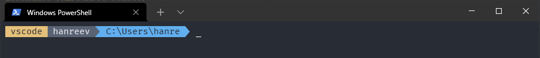

# Microsoft PowerShell Profile

Custom PowerShell prompt

## Prompt display
- Basic
  
  
- Error in previous command
  

- Administrator
  
  
- Git
  
  
- Git dirty
  

- Python virtual env
  

## Oh-My-Zsh Shortcuts
- Git
- Yarn
- Composer
